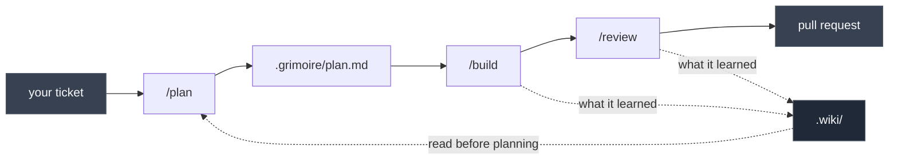
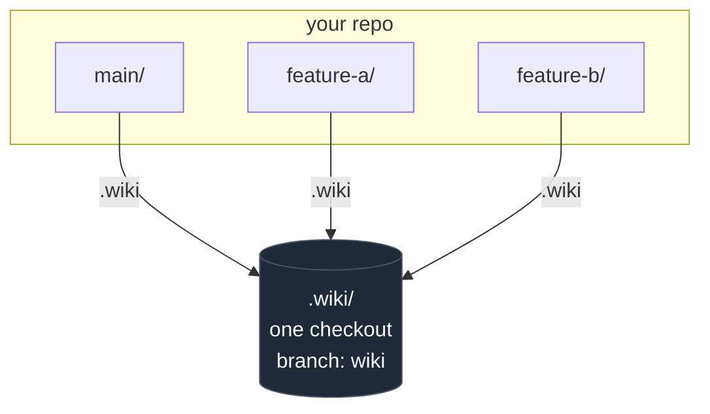

# Grimoire

**Your agent relearns the codebase every session.**

You explain the architecture. You explain the trap in the date handling. You explain why that module looks wrong but is load bearing. Then the context window fills, the session ends, and tomorrow you explain all of it again.

Grimoire gives a project somewhere to keep what it learned, and gives you a set of skills that read from it before they do anything.

```
.grimoire/     what you are working on today
.wiki/         what this project has learned
```

Two folders at the root of your repo. That is the whole idea.



The solid line is one ticket, start to finish. The dotted line is the part that usually goes missing: what the work taught you, going somewhere it can be found again.

---

## Install

```
/plugin marketplace add skarif2/GRIMOIRE
/plugin install grimoire@grimoire
```

Then, in any project you want a memory for:

```
/wiki-init
```

That is it. Nothing else to configure, no files to edit, no paths to set.

---

## The five minute version

**Start a ticket.**

```
/plan add rate limiting to the upload endpoint
```

It reads your ticket from the tracker, asks you a handful of sharp questions, argues with your assumptions, and writes a plan only once you have actually approved it. Not "sounds good". Actually approved.

**Do the work.**

```
/build
```

It executes the plan, verifies each step, reviews its own diff, and drafts the pull request. It never commits. It hands you the command and lets you run it.

**Check the work.**

```
/review
```

Five reviewers read your diff at once, one for correctness, one for quality, one for architecture, one for tests, one for security. They report side by side. None of them is allowed to bury another's findings.

---

## What you get

**Plan and build**

| | |
|---|---|
| `/plan` | Interviews you before writing anything. Reads the ticket. Splits work that is too big for one sitting. |
| `/build` | Runs the plan, verifies every step, reviews itself, drafts the PR. |

**Check the work**

| | |
|---|---|
| `/review` | Five lenses in parallel, severity rated, with an explicit note on how strong the evidence is. |
| `/adversary` | Assumes your plan is wrong and tries to prove it. Reports only what survives its own attempt to refute it. |
| `/debug` | Refuses to guess. No hypothesis until it has a command that reproduces the bug on demand. |

**Keep what you learned**

| | |
|---|---|
| `/wiki-init` | Gives this project a wiki. Once per repo. |
| `/handoff` | Catches an idea that surfaced mid task and packages it for later. |
| `/retro` | Looks at how the session went and improves the setup, not the code. |

**Write like a person**

| | |
|---|---|
| `/unslop` | Strips the tells out of anything a human will read. |
| `/bro` | Says your own message back to you in plain words, so you can see what landed. |

**Quick answers**

| | |
|---|---|
| `/skim` | Fast answer. Touches nothing. |
| `/dig` | Deep answer. Touches nothing. |

---

## The part nobody else does

If you use git worktrees, you know the problem. Notes in one worktree are invisible from the others. Commit them and they ride a feature branch. Merge them and they conflict, because everyone is appending to the same file.

Grimoire puts the wiki on its own orphan branch, checks it out exactly once, and points every worktree at that single copy.



Every worktree points at the same folder. Not a copy of it, the same one.

Write a page while working on one branch and it is readable from every other branch immediately. No commit. No merge. No pull.

The branch shares no history with `main`, so a wiki page can never appear in a feature diff and can never cause a conflict. Your teammates get it with one command, and their normal clone stays exactly as clean as it was.

---

## Four promises

**It never commits.** It writes the message, scopes the files, and hands you a command. You run it. Every time.

**It never writes comments you did not ask for.** There is a closed list of three cases where a comment earns its place. Everything else gets deleted by an agent that never wrote the code and has nothing to defend.

**It never writes tests you did not ask for.** It will tell you in one line what is worth covering, then stop and wait.

**It never writes to the wiki behind your back.** It drafts the pages, shows you, and waits.

---

## Your workplace may not allow this

Plenty of teams cannot put engineering notes in a branch, and plenty of codebases are not yours to annotate. So the wiki is off until you turn it on.

No `.wiki` folder means the project never opted in. Every skill notices, stays quiet, and gets on with the work. It will not create one, will not write to one, will not offer, and will not remark on its absence.

You can run `/plan`, `/build`, `/review` and everything else on a repo with no wiki at all. You simply get less prior knowledge, which is exactly what you have today.

---

## Requirements

Claude Code, and `git`. `gh` if you want tickets read and pull requests drafted for you.

---

## Status

Version 0.1.0. Young, and honest about it. The design is settled and every piece has been checked, but it has not yet been run in anger across a long stretch of real work. Expect rough edges, and please report them.

---

## Why "Grimoire"

A grimoire is a book you keep, add to, and consult before attempting something difficult. It is not a manual someone handed you. It is the one you wrote, from things that actually happened.

That is the entire pitch. Your agent should have one.

---

## Standing on other people's work

Very little here is original. Most of it is an idea someone else had, adapted to fit two folders and a rule against doing anything without asking. Naming names, because vague thanks is worth nothing.

**[mattpocock/skills](https://github.com/mattpocock/skills)** is the largest debt. `/adversary`, `/handoff` and the shape of `/plan` all began there. So did four ideas that changed the design: posting a brief as a ticket comment that supersedes a stale description, treating phases as a dependency graph with a takeable frontier rather than a queue, the fog test that separates a decision from a build step, and `/debug` refusing to form a hypothesis until it has a command that reproduces the bug. `/retro`, and the rule that coding standards belong to the reviewer rather than the implementer, are his too.

**[addyosmani/agent-skills](https://github.com/addyosmani/agent-skills)** taught `/plan` how to interview. Attaching a guess to every question so you react instead of composing, and refusing to accept "sounds good" as approval, both come from there. So does the list of signals that work is too big for one sitting, the habit of watching a diff for a quietly lowered bar, and the change summary section that says what was deliberately left alone.

**[cursor/plugins](https://github.com/cursor/plugins/tree/main/pstack)** gave us `/unslop` almost whole, including the stable rule numbers that let other skills cite a rule instead of restating it. Their comment agent is the ancestor of ours, and its best idea survives intact: when a comment explains a surprise in your own code, do not delete the comment, name the rename or extraction that would make the prose unnecessary. `/bro`, the evidence ladder, and the rule that a judge should run on a different model family than the author are all theirs.

**Andrej Karpathy** for the compiled wiki pattern, the idea that raw notes and distilled pages are different layers and mixing them is what makes a knowledge base rot.

**Martin Fowler**, whose smell catalogue the quality reviewer reads verbatim.

Where an idea was worth taking but came wrapped in a fixed sequence of steps or a mandated folder layout, we took the idea and left the rest. That is a compliment to the thinking, not a criticism of the packaging.

---

Built by [Fazlul Haque Arif](https://github.com/skarif2). MIT licensed.
